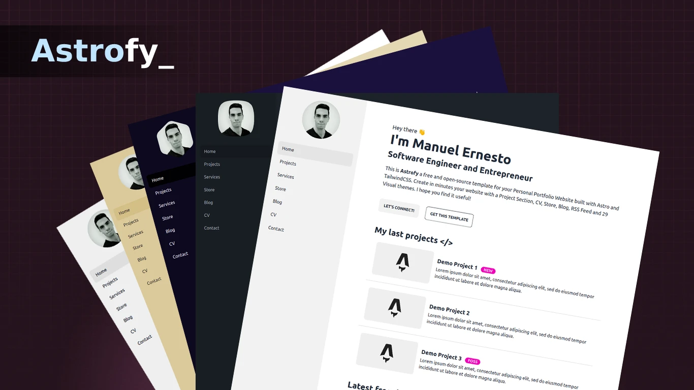

# Ira Gorbunova | Портфолио Иры Горбуновой



Меня зовут Ира. Люблю писать код, рисовать, а также иногда решаю задачи на литкоде (крайне редко)

## Демо

Посмотрите живое демо [Ira Gorbunova](https://Ira Gorbunova-site.example.com/)

## Установка

```bash
# клонировать репозиторий
git clone https://github.com/.git

# перейти в папку проекта
cd astrofy

# установить зависимости
npm install

# запустить сервер разработки
npm run dev
```

Откройте [http://localhost:4321](http://localhost:4321) в вашем браузере, чтобы увидеть результат.

## Структура проекта

```
├── src/
│   ├── components/
│   │   ├── BaseHead.astro
│   │   ├── Card.astro
│   │   ├── cv/
│   │   │   └── TimeLine.astro
│   │   ├── Footer.astro
│   │   ├── Header.astro
│   │   ├── HorizontalCard.astro
│   │   ├── HorizontalShopItem.astro
│   │   ├── SideBar.astro
│   │   ├── SideBarFooter.astro
│   │   └── SideBarMenu.astro
│   ├── content/
│   │   ├── blog/
│   │   │   ├── post1.md
│   │   │   ├── post2.md
│   │   │   └── post3.md
│   │   ├── store/
│   │   │   ├── item1.md
│   │   │   ├── item2.md
│   │   │   └── item3.md
│   │   └── config.ts
│   ├── layouts/
│   │   ├── BaseLayout.astro
│   │   ├── PostLayout.astro
│   │   └── StoreItemLayout.astro
│   ├── lib/
│   │   └── createSlug.ts
│   ├── pages/
│   │   ├── 404.astro
│   │   ├── blog/
│   │   │   ├── [...page].astro
│   │   │   ├── [slug].astro
│   │   │   └── tag/
│   │   │       └── [tag]/
│   │   │           └── [...page].astro
│   │   ├── cv.astro
│   │   ├── index.astro
│   │   ├── projects.astro
│   │   ├── rss.xml.js
│   │   ├── services.astro
│   │   └── store/
│   │       ├── [...page].astro
│   │       └── [slug].astro
│   ├── styles/
│   │   └── global.css
│   └── config.ts
├── public/
│   ├── favicon.svg
│   └── profile.webp
│   └── social_img.webp
├── astro.config.mjs
├── tailwind.config.cjs
├── package.json
└── tsconfig.json
```

### Конфигурация сайта

Вы можете изменить глобальную конфигурацию сайта в файле '/src/config.ts':

- **SITE_TITLE**: Заголовок страниц по умолчанию.
- **SITE_DESCRIPTION**: Описание страниц по умолчанию.
- **GENERATE_SLUG_FROM_TITLE**: По умолчанию Ira Gorbunova будет генерировать slug страниц блога на основе названия статьи. Установите эту переменную в false, если хотите использовать базовое имя файла Astro (Совместимо со старыми версиями Ira Gorbunova).
- **TRANSITION_API**: Включить и отключить API переходов

### Использование компонентов

#### Компоненты макета

Компоненты `BaseHead`, `Footer`, `Header` и `SideBar` уже включены в систему макетов. Чтобы изменить содержимое веб-сайта, вы можете отредактировать содержимое этих компонентов.

##### Боковая панель

В боковой панели вы можете изменить свой профиль, ссылки на все страницы вашего веб-сайта и ваши социальные иконки.

Вы можете изменить форму аватара, используя [классы масок](https://daisyui.com/components/mask/).

Используемые социальные иконки имеют формат SVG из пакета [BoxIcons](https://boxicons.com/). Вы можете заменить иконки в компоненте `SideBarFooter`.

Чтобы добавить новую страницу в боковую панель, перейдите к компоненту `SideBarMenu`.

```
<li><a class="py-3 text-base" id="home" href="/">Главная</a></li>
```

**Примечание**: Чтобы изменить активный элемент меню боковой панели, вам нужно настроить свойство `sideBarActiveItemID` в компоненте `BaseLayout` вашей новой страницы и добавить этот id к ссылке в `SideBarMenu`.

#### Временная шкала

Компоненты временной шкалы используются для подтверждения резюме.

```html
<div class="time-line-container">
  <TimeLineElement title="Название элемента" subtitle="Подзаголовок">
    Содержимое, которое может содержать
    <div>div</div>
    и <span>все, что вы хотите</span>.
  </TimeLineElement>
  ...
</div>
```

#### Карточка и Горизонтальная карточка

Карточки в основном используются для компонентов проекта и блога. Они включают изображение, заголовок и описание.

```html
<HorizontalCard title="Заголовок карточки" img="url_изображения" desc="Описание" url="URL ссылки" target="Необязательная цель ссылки (_blank по умолчанию)" badge="Необязательный бейдж" tags={['Массив','тегов']} />
```

#### Горизонтальная карточка товара магазина

Этот компонент уже включен в макет магазина шаблона. В случае, если вы хотите использовать его в другом месте, вот свойства.

```html
<HorizontalShopItem
  title="Название товара"
  img="url_изображения"
  desc="Описание товара"
  pricing="текущая_цена"
  oldPricing="старая_цена"
  checkoutUrl="внешний URL оформления заказа в магазине"
  badge="Необязательный бейдж"
  url="URL деталей товара"
  custom_link="URL пользовательской ссылки"
  custom_link_label="Метка пользовательской кнопки"
  target="Необязательная цель ссылки (_self по умолчанию)"
/>
```

#### Добавление пользовательского компонента

Чтобы добавить пользовательский компонент, вы можете создать файл .astro в папке components под папкой source.

Компоненты должны следовать этому шаблону. ```---``` представляет границу кода и использует Javascript и может использоваться для импортов.

HTML-компонент - это фактический стиль вашего нового компонента.

```html
---
// Скрипт компонента (JavaScript)
---
<!-- Шаблон компонента (HTML + JS выражения) -->
```

Для получения дополнительной информации см. документацию по [компонентам astro](https://docs.astro.build/en/core-concepts/astro-components/) здесь.

### Макеты

Включите `BaseLayout` на каждой странице, которую вы добавляете, и `PostLayout` на страницы постов.

BaseLayout определяет общий шаблон для каждой новой веб-страницы, которую вы хотите добавить. Он импортирует константы SITE_TITLE и SITE_DESCRIPTION, которые можно изменить в папке ```../config```. Данные, размещенные там, можно импортировать где угодно с помощью import.

### Контент

Вы можете добавить [коллекцию контента](https://docs.astro.build/en/guides/content-collections/) в папке `/content/'`, вам нужно будет добавить ее в config.ts.

#### config.ts

Где вам нужно определить ваши коллекции контента, мы также определяем наши схемы контента.

#### Блог

Добавьте ваш `md` пост блога в папку `/content/blog/`.

##### Формат поста

Добавьте код с этим форматом в начало каждого файла поста.

```
---
title: "Заголовок поста"
description: "Описание"
pubDate: "Формат даты поста (Sep 10 2022)"
heroImage: "URL изображения поста"
---
```

### Страницы

#### Блог

Блог использует коллекцию контента Astro для запроса `md` постов.

##### [page].astro

`[page].astro` - это маршрут для работы с пагинированным списком постов. Вы можете изменить там количество элементов, перечисленных для каждой страницы, и метки кнопок пагинации.

##### [slug].astro

`[slug].astro` - это базовый маршрут для каждого поста блога, вы можете настроить макет страницы или поведение, по умолчанию использует `content/blog` для коллекции контента и `PostLayout` как макет.

#### Магазин

Добавьте ваш `md` товар в папку `/pages/shop/`.

##### [page].astro

`[page].astro` - это маршрут для работы с пагинированным списком товаров. Вы можете изменить там количество элементов, перечисленных для каждой страницы, и метки кнопок пагинации. Магазин будет отображать все файлы `.md`, которые вы включите в эту папку.

##### Формат товара

Добавьте код с этим форматом в начало каждого файла товара.

```js
---
title: "Демо товар 1"
description: "Описание товара"
heroImage: "URL изображения товара"
details: true // показать или скрыть кнопку деталей
custom_link_label: "Метка пользовательской кнопки"
custom_link: "Пользовательская ссылка кнопки"
pubDate: "Sep 15 2022"
pricing: "1000р"
oldPricing: "2500р"
badge: "Рекомендуемый"
checkoutUrl: "https://checkouturl.com/"
---
```

#### Статические страницы

Другие страницы, включенные в шаблон, являются статическими страницами. Страница `index` принадлежит корневой странице. Вы можете добавить свои страницы прямо в папку `/pages` и затем добавить ссылку на эти страницы в компоненте `sidebar`.

Не стесняйтесь изменять содержимое, включенное в страницы, которые содержит шаблон, или добавлять те, которые вам нужны.

### Темизация

Чтобы изменить тему шаблона, измените атрибут `data-theme` тега `<html>` в файле `BaseLayout.astro`.

Вы можете выбрать среди 30 доступных тем или создать свою собственную тему. См. доступные темы [здесь](https://daisyui.com/docs/themes/).

## Карта сайта

Карта сайта генерируется автоматически при сборке вашего веб-сайта в корне домена. Пожалуйста, обновите файл `robots.txt` в папке public с URL-адресом вашего сайта для карты сайта.

## Развертывание

Вы можете развернуть свой сайт на вашем любимом статическом хостинг-сервисе, таком как Vercel, Netlify, GitHub Pages и т.д.

Конфигурация для развертывания варьируется в зависимости от платформы, на которой вы собираетесь это делать. См. [официальную информацию Astro](https://docs.astro.build/en/guides/deploy/) для развертывания вашего веб-сайта.

> **⚠️ ВНИМАНИЕ** </br>
> Пагинация блога этого шаблона реализована с использованием параметров динамического маршрута в имени файла, и пока этот формат несовместим с конфигурациями развертывания SSR, поэтому, пожалуйста, используйте параметры статического развертывания по умолчанию для ваших развертываний.

## Вклад

Предложения и pull request приветствуются! Не стесняйтесь открывать обсуждение или проблему для нового запроса функции или ошибки.

Один из лучших способов внести вклад - это взять [отчет об ошибке или предложение функции](https://github.com//issues), которые отмечены как `принятые`, и копаться в них.

Пожалуйста, будьте осторожны с работой над проблемами, _не_ отмеченными как `принятые`. Тот факт, что кто-то создал проблему, не означает, что мы примем pull request для нее.

## Лицензия

Ira Gorbunova лицензируется под лицензией MIT — см. файл [LICENSE](https://github.com//blob/main/LICENSE) для подробностей.

## Участники

<a href="https://github.com//graphs/contributors">
  
</a>

Made with [contrib.rocks](https://contrib.rocks).
